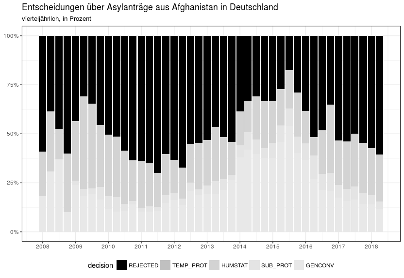

### Die Asyldaten von Eurostat
Dieser Artikel untersucht die Erstentscheidungen von afghanischen Fü?chtlingen in Europa mit Hilfe von Eurostat. Eurostat ist das statistische Amt der Europäischen Union. Es sammelt und veröffentlicht Daten zu vielen Themen, unter anderem zu Asyl und Migration.

Besonders interessant sind die Erstentscheidungsdaten. Das Datenset dafür nennt sich migr_asydcfsta`: "Erstinstanzliche Entscheidungen über Asylanträge nach Staatsangehörigkeit, Alter und Geschlecht; jährliche aggregierte Daten". 

Für Deutschland sind das die Entscheidungen des Bundesamts für  Migration und Flüchtlinge (BAMF). Die Bezeichnung "erstinstanzlich" ist hier etwas verwirrend, denn die erste _juristische_ Instanz ist in Deutschland das Verwaltungsgericht, dass über Klagen gegen die Entscheidung des BAMF entscheidet. Das bedeutet auch, dass ein Teil der hier dargestellten Entscheidungen von Gerichten aufgehoben werden.

Zurück zu unseren Daten. Sie decken die Jahre 2008 bis 2017 ab (Stand September 2018). Man kann sie von der Website von Eurostat herunterladen. Allerdings sind sie sind ziemlich groß - 85 Mb und 13 Millionen Werte. Mit Excel kommt man da nicht weiter, deswegen benutzt dieser Artikel die Statistiksprache `R`. 

### Die Anerkennungsquote von afghanischen Staatsangehörigen in Deutschland: Hintergrund

Agnes >>>
Im Folgenden werden wir die Anerkennungsquote für afghanische Staatsangehörige betrachten, erst in Deutschland, dann im Vergleich zu anderen europäischen Ländern, und schließlich im Vergleich zu anderen Herkunftsländern. 

Die Anerkennungsquote ist in vieler Hinsicht wichtig. Politisch gilt sie als Indikator, ob Asylsuchende "zu Recht" nach Deutschland gekommen sind. Pragmatisch bedeutet eine Anerkennungsquote über 50% eine "gute Bleibeperspektive" und damit verbesserte Integrationsangebote in den ersten Monaten oder Jahren. Das BAMF beschreibt das so (http://www.bamf.de/SharedDocs/FAQ/DE/IntegrationskurseAsylbewerber/001-bleibeperspektive.html):

> Menschen, die aus Herkunftsländern mit einer Schutzquote von über 50 Prozent kommen, haben eine gute Bleibeperspektive. 2017 trifft dies auf die Herkunftsländer Eritrea, Irak, Iran, Syrien und Somalia zu. Welche Herkunftsländer das Kriterium Schutzquote (>/= 50 %) erfüllen, wird halbjährlich festgelegt.
 
Bei schlechter Bleibeperspektive ist die Integration also erwschwert, während des Asylverfahrens gibt es keine Integrationskurse und keine Maßnahmen zur Arbeitsförederung. Wie lange dauert ein Asylverfahren? Laut der neuesten [Kleinen Anfrage "Ergänzende Informationen zur Asylstatistik"](https://kleineanfragen.de/bundestag/19/3861-ergaenzende-informationen-zur-asylstatistik-fuer-das-erste-und-zweite-quartal-2018-schwerpunktfragen-zur ) allgemein etwa 9 Monate, bei Anträgen aus Afghanistan allerdings über 13 Monate. 

Diese Regelung ist übrigens kein Gesetz, sondern eine [Auslegung](https://www.proasyl.de/wp-content/uploads/2015/12/161202-BAMF-Vermerk-Gute-Bleibeperspektive_Integrationskurszugang-v2-6....pdf) des BAMF. Sie entwickelte sich im Laufe des Jahrs 2015. [Pro Asyl](https://www.proasyl.de/news/die-einstufung-nach-bleibeperspektive-ist-bewusste-integrationsverhinderung/) kritisiert das Konzept der Bleibeperspektive grundsätzlich.

Wenn man die Gesamtschutzquote des BAMF genauer anschaut, stellt man fest, dass ihre Berechnung hochgradig eigenwillig ist. Ein Asylantrag kann positiv, negativ oder gar nicht entschieden werden. Wenn der Antrag zurückgezogen wurde, die Antragsstellerin gestorben ist, weitergewandert, untergetaucht, geheiratet hat, per Dublinabkommen innerhalb von Europa weiterverschoben wurde - dann wird der Antrag ohne inhaltliche Entscheidung geschlossen. Die Anerkennungsquote ist die Anzahl aller positiven Anträge geteilt durch die Anzahl aller positiv oder negativ entschiedener Anträge. Die nicht entschiedenen Anträge müssen aus der Gesamtzahl herausgerechnet werden. Es ist unbekannt, ob sie negativ oder positiv entschieden worden wären, wenn die Betroffene nicht beispielsweise gestorben wäre.

Das ist aber nicht, wie das BAMF seine "Gesamtschutzquote" berechnet (https://de.wikipedia.org/wiki/Gesamtschutzquote). Hier sind die formellen Entscheidungen, also die nicht inhaltlichen Entscheidungen, in der Gesamtzahl mit enthalten. Die sinnvoll berechnete Quote heißt beim BAMF "bereinigte Gesamtschutzquote". Sie liegt höher als die "Gesamtschutzquote", weil durch eine kleinere Zahl geteilt wird.

Wie viel höher ist diese korrekt berechnete "bereinigte Gesamtschutzquote"? Das hängt von dem Anteil "sonstigen Erledigungen" ab, der gerade in den letzten Monaten sehr hoch ist. Im Juli 2018 lag dieser Anteil über all Herkunftsländer bei 39%. Über alle Herkunftsländer ist die Gesamtschutzquote damit nur 29%, die bereinigte Gesamtschutzquote aber 48%. Bei manchen Ländern ist der Effekt noch größer. (http://www.bamf.de/SharedDocs/Anlagen/DE/Downloads/Infothek/Statistik/Asyl/hkl-antrags-entscheidungs-bestandsstatistik-juli-2018.html).

Wenn wir uns nun wieder den Daten zu Erstentscheiden von afghanischen Asylsuchenden anschauen, müssen wir auch im Hinterkopf behalten, dass gegen die negativen Entscheidungen oft geklagt wird, und dass die Verwaltungsgerichte sie oft aufheben (60% oder 70%, quelle? xxx )

Afghanistan ist ein ungewöhnliches Herkunftsland, mit einer langen Geschichte von Flucht. "In der Zeit von 1978 bis 2012 stellte Afghanistan die höchste Zahl von Flüchtlingen weltweit (seit 2013 hat Syrien diese Position übernommen)." (http://www.kas.de/afghanistan/de/publications/48440/)
Es hält Rang 9 im "Fragile State Index", und ist mit seinem Punktestand nach sozialen, wirtschaftlichen und politischen Indikatoren in der "High Alert"-Gruppe der 178 erfassten Länder. Dieser Index wurde 2005 als "Failed State Index" eingeführt, damals belegte Afghanistan Platz 11. 

<<< Agnes

### Die Anerkennungsquote von afghanischen Staatsangehörigen in Deutschland: Zurück zu den Daten

Erst einmal schauen wir uns an, wie sich die Entscheidungen des BAMF über Anträge von afghanischen Staatsangehörigen über die Zeit entwickelt hat. In absoluten Zahlen sieht das aus wie in Abbildung 1.   
 Der Einbruch im dritten Quartal 2017 war die Folge eines schweren Anschlags, der auch die deutsche Botschaft beschädigte. 

Hier wird die bereinigte Quote gezeigt, nicht inhaltlich entschiedene Anträge werden nicht dargestellt. Im Laufe des Jahres 2015 etablierte sich der Begriff der Bleibeperspektive. 2016 lag die Anerkennungsquote noch einmal über 50%, seit 2017 darunter.

Wenn man diese Zahlen sieht und die Bedeutung der 50% kennt, fragt man sich: Kann es sein, dass über jeden Asylantrag aus Afghanistan einzeln und unabhängig entschieden wird, und sich seit Anfang 2017 am Ende jedes halben Jahres jedes Mal herausstellt, dass die Anerkennungsquote knapp unter 50% liegt? 

### Vergleich mit anderen europäischen Ländern: Warum das wichtig ist

Agnes >>>
Wie ist die Anerkennungsquote in anderen Ländern Europas? Das ist wichtig. Das europäische Asylsystem basiert darauf, dass es keine Rolle spielt, in welchem Land jemand seinen Asylantrag stellt. Die Dublin-Abkommen setzen das auch voraus.

Agnes <<<
### Vergleich mit anderen europäischen Ländern: Zahlen

Eurostat liefert Daten von 31 europäischen Staaten. Von vielen dieser Länder gibt es aber so wenig Entscheidungen, dass sich keine aussagekräftige Quote errechnen lässt. Deshalb grenzen wir unseren Vergleich auf die ein, in denen mindestens 1000 Entscheidungen getroffen wurden, und beschränken uns außerdem auf das Jahr 2017.

#### Die Anzahl Entscheidungen pro Antragsland

Dies sind die europäischen Länder, in denen im Jahr 2017 mehr als 1000 Entscheidungen über Asylanträge von afghanischen Staatsangehörigen getroffen wurden:
    

"| values|geo   |label                                          |"
"|------:|:-----|:----------------------------------------------|"
"| 184265|TOTAL |Insgesamt                                      |"
"| 109732|DE    |Deutschland (bis 1990 früheres Gebiet der BRD) |"
"|  25155|SE    |Schweden                                       |"
"|  17730|AT    |Österreich                                     |"
"|   7516|FR    |Frankreich                                     |"
"|   5160|BE    |Belgien                                        |"
"|   3094|CH    |Schweiz                                        |"
"|   2134|EL    |Griechenland                                   |"
"|   1972|IT    |Italien                                        |"
"|   1909|UK    |Vereinigtes Königreich                         |"
"|   1894|NL    |Niederlande                                    |"
"|   1800|HU    |Ungarn                                         |"
"|   1518|NO    |Norwegen                                       |"
"|   1388|BG    |Bulgarien                                      |"
"|   1349|DK    |Dänemark                                       |"
"|   1334|FI    |Finnland                                       |"

Wenn Du an diesen Zahlen zweifelst und sie selber überprüfen willst, finde ich das genau richtig. Misstrauen in Daten ist gut. Eurostat hat einen Data Explorer unter eurostat -> Daten -> Datenbank -> Datenbank nach Themen -> Bevölkerung und soziale Bedingungen -> Asyl und Gesteuerte Migration, oder Du googelst nach "migr_asydcfsta".

Diese Zahlen sind für mich schon überraschend. Die anderen 17 Länder sind zusammen für weniger als 600  Entscheidungen verantwortlich.

Eine Visualisierung der Gesamtanzahl von Entscheidungen zu Afghanistan im Jahr 2017:

Spanien beispielsweise ist nicht in unserer Analyse vertreten, weil es nicht auf 1000 Entscheidungen kommt. Deutschland verantwortet fast 60% aller Entscheidungen. 

Nun ist Deutschland auch das bevölkerungsreichste Land der EU. Wenn wir uns die EU-Länder mit mehr als 8 Mio Einwohnern anschauen und neben ihre Einwohnerzahl (geteilt durch 1000) die Anzahl Entscheidungen stellen, erhalten wir dieses Bild:

In den großen Ländern außer Deutschland gab es auffallend wenig Entscheidungen, in den kleinen Ländern Schweden und Österreich dagegen überproportional viele. 

Bisher haben wir Vorbetrachtungen angestellt, um unsere Daten zu verstehen und zu überlegen, welche europäischen Aufnahmeländer wir sinnvoll untersuchen können. Jetzt kommen wir zu den Entscheidungen.

### Die Entscheidungen im europäischen Vergleich

Wir beschränken unsere Analyse also auf 15 Länder. Was für Entscheidungstypen haben wir überhaupt? Positive und negative, wobei sich die positiven feiner unterteilen. 

"|code      |label                                |"
"|:---------|:------------------------------------|"
"|TOTAL_POS |Gesamtzahl der positiven Beschlüssen |"
"|GENCONV   |Genfer Abkommen Rechtsstatus         |"
"|HUMSTAT   |Humanitärer Rechtsstatus             |"
"|REJECTED  |Abgelehnt                            |"
"|SUB_PROT  |Subsidiärer Schutz                   |"
"|TEMP_PROT |Vorübergehender Schutz               |"

Es gilt:

 GENCONV + HUMSTAT + SUB_PROT + TEMP_PROT + REJECTED 
 = TOTAL_POS + REJECTED 
 = TOTAL
 
In der Datenbank von Eurostat gibt es keine "sonstigen Erledigungen" oder formelle Entscheidungen.
In absoluten Zahlen sieht das so aus:

Und prozentual stellt es sich folgendermaßen dar:

Das schwankt sehr. Die Quote muss nicht überall gleich sein - es ist beispielsweise denkbar, dass afghanische Asylsuchende einer besonders stark verfolgten Minderheit vor allem in einem europäischen Land Anträge stellen, und die Quote deshalb dort höher ist. Aber dieses Bild sieht nicht richtig aus. 
Deutschland liegt 

#### Was ist in Schweden passiert?

Im Laufe des Jahres 2015 hat Schweden seine Flüchtlingspolitik dramatisch verändert. Im Herbst hieß es in einer Pressekonferenz, 

> „Es schmerzt mich, dass Schweden nicht in der Lage ist, auf diesem Niveau weitere Asylsuchende aufzunehmen“

Um zu sehen, ob diese Politikänderung sich in den Anerkennungsquoten niedergeschlagen hat, stellen wir die zeitlichen Verlauf für Schweden dar. Und ja, es hat sich deutlich niedergeschlagen.

## Ist Afghanistan eine Ausnahme? Sind die Anerkennungsquoten anderer Länder ähnlicher?
 
* anderes Land, eins mit hoher, eins mit niedriger Anerkkenungsquote? Syrien, 

#### Mehr Politik als Rechtsstaatlichkeit

Bis zu diesem Punkt habe ich den Artikel eher trocken gehalten, juristisch und zahlenorientiert. Abschließend möchte ich doch noch einige persönliche Anmerkungen loswerden.
--- 

--- oder
Die jungen Männer, die ich in der Unterkunft treffe, sind immer wieder im Stich gelassen und verraten worden. Von ihrem Geburtsland Afghanistan, in dem 25% (?) der Kinder arbeiten, nur xx % zur Schule gehen und diese Schulen offensichtlich schlecht sind. Vom Iran, der die afghanischen Flüchtlinge entrechtet und in den Krieg nach Syrien schickt (link). Von Deutschland, das sie in einem ganz ungesunden Schwebezustand hält, dem Abschreckung wichtiger ist als die Integration, und als rechtsstaatliche Prinzipien. Von der EU, die es nicht schafft, sich auf eine konsistente und sinnvolle gemeinsame Asylpolitik im Sinne der Genfer Flüchtlingskonvention zu einigen. Von der internationalen Staatengemeinschaft, die keinen Umgang mit den "Fragile States" findet. Alle Staaten, alle internationalen Organisation, alle Gesellschaften sind an ihrer Aufgabe gescheitert, diesen Leuten einen Rahmen zu bieten, in dem sie so leben können, wie es im 21. Jahrhundert üblich ist: Mit Ausbildung und Perspektive auf ein ganz normales Leben mit Familie und Arbeit. 

Es ist zum Verrücktwerden. Im Großen ist dagegen nicht anzukommen. Jede und jeder, die oder der hier Lesen und Schreiben lernt, oder es sogar schafft, sich ein gutes Leben aufzubauen, ist ein Triumph über diese Zustände.

### Über diesen Artikel

Seit 2016 beschäftigt sich der Refugee Datathon Munich mit Asylzahlen. Die Gruppe trifft sich regelmäßig, um Daten zugänglich und verständlich zu machen und so den Flüchtlingsunterstützer/innen zuzuarbeiten. Einige Ergebnisse werden veröffentlicht auf https://refugee-datathon-muc.org/. Das Ganze lebt vom Zusammenspiel von Fachwissen und Technik. Sowohl Fachleute als auch IT-Menschen sind immer eingeladen, mitzumachen. 

Kontakt: xxx meetup.com, email? 

### xxx Persönliche Ansicht

    * Afghanistan ist schwierig weil fragile state, dafür wurde das Asylrecht nicht gemacht
    * Die Praxis hat weniger mit Recht zu tun als mit Kalkül: Abschrecken, aber nicht zu viele Skandale provozieren. Das heißt: 
    * Abschreckung, (1) indem man den Leuten die Perspektive nimmt (Anerkennungsquote unter 50%, weniger Integration, Ablehnungen); (2) Abschiebungen - regelmäßig, aber nicht viele.
    * Denn sonst würden sich die Fälle häufen, dass Abgeschobene sterben, und das will man auch nicht
    * zugleich Behauptung, dass das alles Kriminelle sind - stimmt nicht 

Mieses Spiel. Und gefährlich, viele junge Leute ohne Perspektive in D. Die internationale Gemeinschaft soll sich mal systematisch Gedanken drüber machen, wie sie mit den failed states umgeht.
Nicht alles "Schuld von Deutschland". Afghanistan, Iran haben diese Leute auch verraten

### Ab hier nur Notizen

Analysis: 

* FR, CH, EL, IT clearly more positive 
* BG very negative - still 1388 decisions
* SE switched midway, monthly data?
 
Does this look like "it doesn't matter where in the EU you apply for asylum"?

Next questions:

* years 2015, 2016 (simple), 2018 (quarterly data)
* Deportations? We barely have numbers from DE ... probably no way (only Dublin numbers. bpb has sth on https://www.bpb.de/gesellschaft/migration/flucht/218788/zahlen-zu-asyl-in-deutschland)

Content to add:

* Situation in Afghanistan (UNAMA - Zahlen, fragile state index)
* Warum verschiedene Quoten in der EU ein Problem sind, Dublin
* Lagebericht: evtl. https://www.proasyl.de/news/meinungsstark-aber-faktenarm-abschiebepolitik-zu-afghanistan/

Code ist hier: https://github.com/muc-fluechtlingsrat/r-eurostat-refugees/blob/master/man/afghanistan_eurostat_nontech.rmd

Links
Geschichte der Auswanderung aus Afghanistan, von Januar 2013
http://www.bpb.de/gesellschaft/migration/kurzdossiers/256457/afghanische-diaspora?p=all
