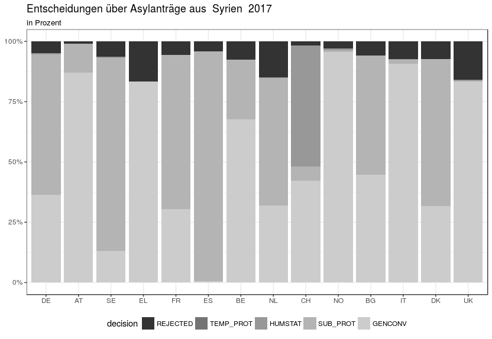
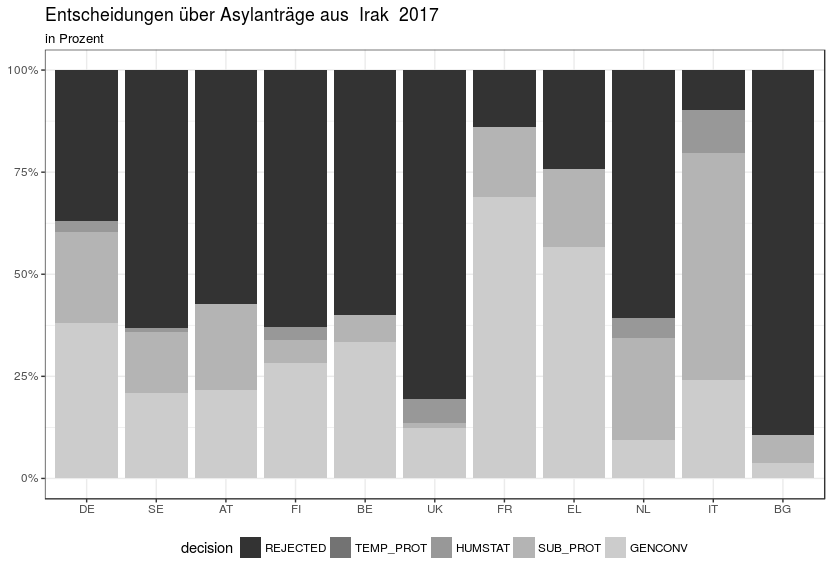
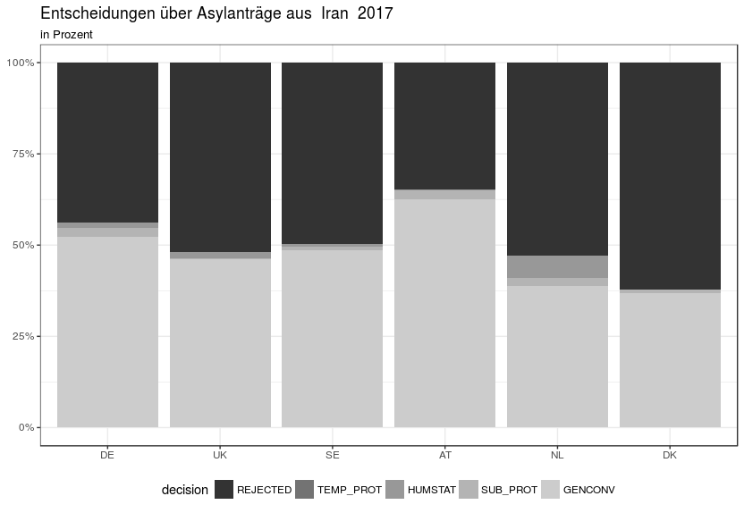
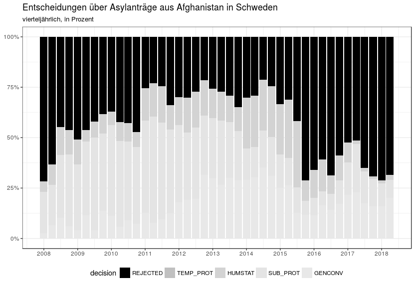

### Die Asyldaten von Eurostat
Dieser Artikel untersucht die Erstentscheidungen von afghanischen Flüchtlingen in Europa mit Hilfe von Eurostat. Eurostat ist das statistische Amt der Europäischen Union. Es sammelt und veröffentlicht Daten zu vielen Themen, unter anderem zu Asyl und Migration.

Besonders interessant sind die Erstentscheidungsdaten. Das Datenset dafür nennt sich migr_asydcfsta`: "Erstinstanzliche Entscheidungen über Asylanträge nach Staatsangehörigkeit, Alter und Geschlecht; jährliche aggregierte Daten". 

Für Deutschland sind das die Entscheidungen des Bundesamts für  Migration und Flüchtlinge (BAMF). Die Bezeichnung "erstinstanzlich" ist hier etwas verwirrend, denn die erste _juristische_ Instanz ist in Deutschland das Verwaltungsgericht, das Klagen gegen die Entscheidung des BAMF verhandelt. Das bedeutet auch, dass ein Teil der hier dargestellten Entscheidungen von Gerichten aufgehoben werden.

Zurück zu unseren Daten. Sie decken die Jahre 2008 bis 2017 ab (Stand September 2018). Man kann sie von der Website von Eurostat herunterladen. Allerdings sind sie sind ziemlich groß - 85 Mb und 13 Millionen Werte. Mit Excel kommt man da nicht weiter, deswegen benutzt dieser Artikel die Statistiksprache `R`. 

### Die Anerkennungsquote von afghanischen Staatsangehörigen in Deutschland: Hintergrund

verschönern >>>

Im Folgenden werden wir die Anerkennungsquote für afghanische Staatsangehörige betrachten, erst in Deutschland, dann im Vergleich zu anderen europäischen Aufnahmeländern, und schließlich im Vergleich zu anderen Herkunftsländern. 

Die Anerkennungsquote ist in vieler Hinsicht wichtig. Politisch gilt sie als Indikator, ob Asylsuchende "zu Recht" nach Deutschland gekommen sind. Pragmatisch bedeutet eine Anerkennungsquote über 50% eine "gute Bleibeperspektive" und damit verbesserte Integrationsangebote in den ersten Monaten oder Jahren. Das BAMF beschreibt das so: 

> Menschen, die aus Herkunftsländern mit einer Schutzquote von über 50 Prozent kommen, haben eine gute Bleibeperspektive. 2017 trifft dies auf die Herkunftsländer Eritrea, Irak, Iran, Syrien und Somalia zu. Welche Herkunftsländer das Kriterium Schutzquote (>/= 50 %) erfüllen, wird halbjährlich festgelegt.
 
Bei schlechter Bleibeperspektive ist die Integration also erwschwert, während des Asylverfahrens gibt es keine Integrationskurse und keine Maßnahmen zur Arbeitsförederung. Wie lange dauert ein Asylverfahren? Laut der neuesten Kleinen Anfrage "Ergänzende Informationen zur Asylstatistik" sind das allgemein etwa 9 Monate, bei Anträgen aus Afghanistan allerdings über 13 Monate. 

Diese Regelung ist übrigens kein Gesetz, sondern eine Auslegung des BAMF. Sie entwickelte sich im Laufe des Jahrs 2015. 

Wenn man die Gesamtschutzquote des BAMF genauer anschaut, stellt man fest, dass ihre Berechnung hochgradig eigenwillig ist. Ein Asylantrag kann positiv, negativ oder gar nicht entschieden werden. Wenn der Antrag zurückgezogen wurde, die Antragsstellerin gestorben ist, oder weitergewandert, oder untergetaucht, wenn sie geheiratet hat oder per Dublinabkommen innerhalb von Europa weiterverschoben wurde - dann wird der Antrag ohne inhaltliche Entscheidung geschlossen. Die Anerkennungsquote ist die Anzahl aller positiven Anträge geteilt durch die Anzahl aller positiv oder negativ entschiedener Anträge. Die nicht entschiedenen Anträge müssen aus der Gesamtzahl herausgerechnet werden. Es ist unbekannt, ob sie negativ oder positiv entschieden worden wären, wenn die Betroffene nicht beispielsweise gestorben wäre.

Das ist aber nicht, wie das BAMF seine "Gesamtschutzquote" berechnet. Hier sind die formellen Entscheidungen, also die nicht inhaltlichen Entscheidungen, in der Gesamtzahl mit enthalten. Die sinnvoll berechnete Quote heißt beim BAMF "bereinigte Gesamtschutzquote". Sie liegt höher als die "Gesamtschutzquote", weil durch eine kleinere Zahl geteilt wird.

Wie viel höher ist diese korrekt berechnete "bereinigte Gesamtschutzquote"? Das hängt von dem Anteil "sonstigen Erledigungen" ab, der gerade in den letzten Monaten sehr hoch ist. Im Juli 2018 lag dieser Anteil über all Herkunftsländer bei 39%. Über alle Herkunftsländer ist die Gesamtschutzquote damit nur 29%, die bereinigte Gesamtschutzquote aber 48%. Bei manchen Ländern ist der Effekt noch größer. 

Wenn wir uns nun wieder den Daten zu Erstentscheiden von afghanischen Asylsuchenden anschauen, müssen wir auch im Hinterkopf behalten, dass gegen die negativen Entscheidungen oft geklagt wird, und dass die Verwaltungsgerichte sie oft aufheben (60% oder 70%, quelle? xxx )

Afghanistan ist ein ungewöhnliches Herkunftsland, mit einer langen Geschichte von Flucht. In der Zeit von 1978 bis 2012 stellte Afghanistan die höchste Zahl von Flüchtlingen weltweit. Sseit 2013 hat Syrien diese Position übernommen. Afghanistan hält im "Fragile State Index" Rang 9 von 178 erfassten Staaten, und ist mit seinem Punktestand nach sozialen, wirtschaftlichen und politischen Indikatoren in der "High Alert"-Gruppe. Dieser Index wurde 2005 als "Failed State Index" eingeführt, damals belegte Afghanistan Platz 11. 

<<< verschönern

### Die Anerkennungsquote von afghanischen Staatsangehörigen in Deutschland: Zurück zu den Daten

Erst einmal schauen wir uns an, wie sich die Entscheidungen des BAMF über Anträge von afghanischen Staatsangehörigen über die Zeit entwickelt hat. In absoluten Zahlen sieht das aus wie in Abbildung 1.   
 Der Einbruch im dritten Quartal 2017 war die Folge eines schweren Anschlags, der auch die deutsche Botschaft beschädigte. 

Prozentuell stellt sich das so dar:

Hier wird die bereinigte Quote gezeigt, nicht inhaltlich entschiedene Anträge sind nicht enthalten. Im Laufe des Jahres 2015 etablierte sich der Begriff der Bleibeperspektive. 2016 lag die Anerkennungsquote noch einmal über 50%, seit 2017 darunter.

Wenn man diese Zahlen sieht und die Bedeutung der 50% kennt, fragt man sich: Kann es sein, dass über jeden Asylantrag aus Afghanistan einzeln und unabhängig entschieden wird, und sich seit Anfang 2017 am Ende jedes halben Jahres jedes Mal herausstellt, dass die Anerkennungsquote knapp unter 50% liegt? 

### Vergleich mit anderen europäischen Ländern: Warum das wichtig ist

verschönern >>>

Wie ist die Anerkennungsquote in anderen Ländern Europas? Das ist wichtig. Das europäische Asylsystem basiert darauf, dass es keine Rolle spielt, in welchem Land jemand seinen Asylantrag stellt. Die Dublin-Abkommen setzen das auch voraus.

verschönern <<<
### Vergleich mit anderen europäischen Ländern: Zahlen

Eurostat liefert Daten von 31 europäischen Staaten. Von vielen dieser Länder gibt es aber so wenig Entscheidungen, dass sich keine aussagekräftige Quote errechnen lässt. Deshalb grenzen wir unseren Vergleich auf die Aufnahmeländer ein, in denen mindestens 1000 Entscheidungen getroffen wurden. Außerdem beschränken wir uns auf das Jahr 2017.

#### Die Anzahl Entscheidungen pro Antragsland

Dies sind die europäischen Länder, in denen im Jahr 2017 mehr als 1000 Entscheidungen über Asylanträge von afghanischen Staatsangehörigen getroffen wurden:
    

| Entscheidungen| Kürzel   |Land
|------:|:-----|:----------------------------------------------|
| 184265|TOTAL |Insgesamt                                      |
| 109732|DE    |Deutschland (bis 1990 früheres Gebiet der BRD) |
|  25155|SE    |Schweden                                       |
|  17730|AT    |Österreich                                     |
|   7516|FR    |Frankreich                                     |
|   5160|BE    |Belgien                                        |
|   3094|CH    |Schweiz                                        |
|   2134|EL    |Griechenland                                   |
|   1972|IT    |Italien                                        |
|   1909|UK    |Vereinigtes Königreich                         |
|   1894|NL    |Niederlande                                    |
|   1800|HU    |Ungarn                                         |
|   1518|NO    |Norwegen                                       |
|   1388|BG    |Bulgarien                                      |
|   1349|DK    |Dänemark                                       |
|   1334|FI    |Finnland                                       |

Diese Zahlen sind nachvollziehbar im Data Explorer von eurostat, unter Daten -> Datenbank -> Datenbank nach Themen -> Bevölkerung und soziale Bedingungen -> Asyl und Gesteuerte Migration, Datenbank "migr_asydcfsta".

Es ist auffällig, dass aus vielen Ländern sehr wenig Entscheidungen kommen. 16 Staaten sind hier nicht aufgeführt, weil sie unter 1000 lagen. Sie sind zusammen für weniger als 600 Entscheidungen verantwortlich. Spanien beispielsweise ist nicht in unserer Analyse vertreten, weil es nicht auf 1000 Entscheidungen kommt. Deutschland verantwortet fast 60% aller Entscheidungen. 

Nun ist Deutschland auch das bevölkerungsreichste Land der EU. Wenn wir uns die EU-Länder mit mehr als 8 Mio Einwohnern anschauen und neben ihre Einwohnerzahl (geteilt durch 1000) die Anzahl Entscheidungen stellen, erhalten wir dieses Bild:

In den großen Ländern außer Deutschland gab es auffallend wenig Entscheidungen, in den kleinen Ländern Schweden und Österreich dagegen überproportional viele. 

Bisher haben wir Vorbetrachtungen angestellt, um unsere Daten zu verstehen und zu überlegen, welche europäischen Aufnahmeländer wir sinnvoll untersuchen können. Jetzt kommen wir zu den Entscheidungen.

### Die Entscheidungen im europäischen Vergleich

Wir beschränken unsere Analyse also auf 15 Länder. Was für Entscheidungstypen haben wir überhaupt? Positive und negative, wobei sich die positiven feiner unterteilen. 

|code      |label                                |
|:---------|:------------------------------------|
|TOTAL_POS |Gesamtzahl der positiven Beschlüssen |
|GENCONV   |Genfer Abkommen Rechtsstatus         |
|HUMSTAT   |Humanitärer Rechtsstatus             |
|REJECTED  |Abgelehnt                            |
|SUB_PROT  |Subsidiärer Schutz                   |
|TEMP_PROT |Vorübergehender Schutz               |

Es gilt:

 GENCONV + HUMSTAT + SUB_PROT + TEMP_PROT + REJECTED    
 = TOTAL_POS + REJECTED    
 = TOTAL   
 
In den Daten von Eurostat gibt es keine "sonstigen Erledigungen" oder formelle Entscheidungen.
In absoluten Zahlen sehen die Entscheidungen in Europa zu Asylanträgen von afghanischen Staatsangehörigen so aus:

Und prozentual stellt es sich folgendermaßen dar:

Deutschland liegt im Mittelfeld, und gerade unter den bekannten 50%. Von Land zu Land schwankt die Quote extrem. Sie muss nicht überall gleich sein - es ist beispielsweise denkbar, dass afghanische Asylsuchende einer besonders stark verfolgten Minderheit vor allem in einem europäischen Land Anträge stellen, und die Quote deshalb dort höher ist. Aber dieses Bild sieht nicht richtig aus. In der Schweiz liegt die Anerkennungsquote bei 97%, in Bulgarian unter 2%, und da soll es keine Rolle spielen, in welchen Land der Antrag gestellt wird? 

#### Sind die Anerkennungsquoten für andere Herkunftsländer ähnlicher im europäischen Vergleich?

Im nächsten Schritt vergleichen wir die Anerkennungsquoten in Europa für andere Herkunftsländer. Wir gehen durch die 10 größten Herkunftsländer und fangen an mit Syrien - das sieht jedenfalls ganz anders aus:

Das nächstgrößte Herkunftsland ist der Irak. Hier sind die Schwankungen wieder erheblich größer. Weit über die Hälfte der Entscheidungen kamen aus Deutschland.

Beim Iran ist das Bild wieder ausgeglichener.

Nigeria:

Pakistan:

Eritrea:

#### Was ist in Schweden passiert?

Im Laufe des Jahres 2015 hat Schweden seine Flüchtlingspolitik dramatisch verändert. Im Herbst hieß es in einer Pressekonferenz, 

> „Es schmerzt mich, dass Schweden nicht in der Lage ist, auf diesem Niveau weitere Asylsuchende aufzunehmen“

Um zu sehen, ob diese Politikänderung sich in den Anerkennungsquoten niedergeschlagen hat, stellen wir die zeitlichen Verlauf der Anerkennungsquote in Schweden dar. Und ja, es ist deutlich zu erkennen.

### Fazit

Theoretisch wird jeder Asylantrag einzeln geprüft und rein juristisch entschieden. Tatsächlich hat die Politik großen Einfluss - den Eindruck bekommt man, wenn man beobachtet, wie die Anerkennungsquote von afghanischen Staatsangehörigen in Deutschland seit 2017 knapp unter 50% liegt, und auch, wenn man die zeitliche Entwicklung der Anerkennungsquote in Schweden verfolgt. 

Der Vergleich der Anerkennungsquoten in Europa zeigt große Unterschiede. Die Behauptung, dass es keine Rolle spiele, wo der Antrag gestellt wird, ist bei den Herkunftsländern Afghanistan und Eritrea unhaltbar.

Die Daten von Eurostat ermöglichen es, bestimmte Trends und Unstimmigkeiten der europäischen Asylpolitik sichtbar zu machen.

### Über den Refugee Datahon Munich 

Seit Ende 2015 beschäftigt sich der Refugee Datathon Munich mit Asylzahlen. Die Gruppe trifft sich alle drei Monate, um Daten zugänglich und verständlich zu machen. Sie nutzen einerseits Methoden von Open Data, wie beispielsweise das Informationsfreiheitsgesetz und fragdenstaat.de. Andererseits setzen sie ihr IT-Wissen ein, um neue Quellen zu erschließen und die Daten in eine brauchbare Form zu bringen. Einige Ergebnisse werden veröffentlicht auf https://refugee-datathon-muc.org/. Das Ziel ist einerseits, allgemein zu besseren Informationen beizutragen, aber auch Flüchtlingsorganisationen zu unterstützen. Das Ganze lebt vom Zusammenspiel von Fachwissen und Technik. Sowohl Fachleute als auch IT-Menschen sind herzlich eingeladen, mitzumachen. 
Der Code zu diesem Artikel ist auf github.

Kontakt: suny.kim@gmx.net

 

